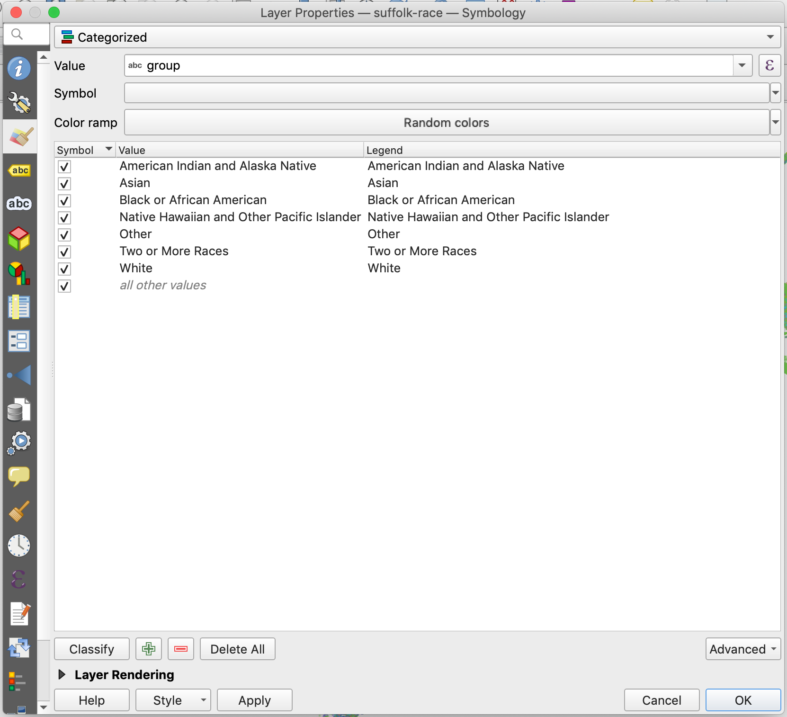

I've been toying with dot density maps, so I needed to figure out how to style dots in QGIS.

The trick is setting the layer style to `Categorized`, choosing a field in the `Symbol` style (`group`, in my case) and hitting the `Classify` button.

That will generate a symbol based on each unique value. I've been using the `Random colors` color ramp, which is fine for testing.
